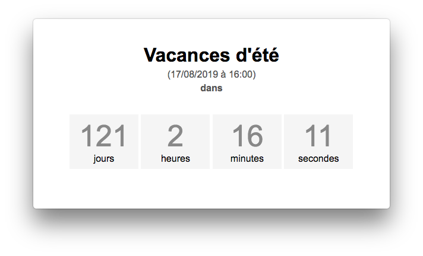

# Compte à rebours (electron)



**Compte à rebours créé avec le framework electron.**


## Inspiration

- [source 1](https://electronjs.org/docs/tutorial/first-app)
- [source 2](http://www.codeblocq.com/2016/06/Build-your-First-Electron-App/)

## How To Use

To clone and run this repository you'll need [Git](https://git-scm.com) and [Node.js](https://nodejs.org/en/download/) (which comes with [npm](http://npmjs.com)) installed on your computer. From your command line:

```bash
# Clone this repository
git clone https://github.com/boissonnfive/compte-a-rebours-electron.git
# Go into the repository
cd compte-a-rebours-electron
# Install dependencies
npm install
# Run the app
npm start
```

Note: If you're using Linux Bash for Windows, [see this guide](https://www.howtogeek.com/261575/how-to-run-graphical-linux-desktop-applications-from-windows-10s-bash-shell/) or use `node` from the command prompt.

## How to set the date

Par défaut, l'application va créer une échéance à 2 jours de la date actuelle. Ce faisant, elle va initialiser un fichier de configuration **config.json** dans le dossier **/Users/nomUtilisateur/Library/Application Support/compte-a-rebours-electron**.

Le format du fichier est le suivant :

    {
        "titre": "Vacances d'été",
        "date": {
            "jour": 17,
            "mois": 8,
            "annee": 2019,
            "heures": 16,
            "minutes": 0
        }
    }

Il suffit de modifier ce fichier pour y mettre les paramètres voulus.

## License

[CC0 1.0 (Public Domain)](LICENSE.md)
